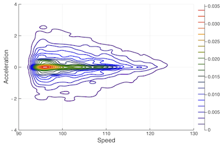

# TeleMap.jl
Driving style and deviation analysis for telemetric data.

This package is still under development.

<!--


 -->
[](https://travis-ci.com/nikpocuca/TeleMap.jl)
[](http://codecov.io/github/nikpocuca/TeleMap.jl?branch=master)

## Summary
Telemetric data is increasing in both quantity and dimension. This package encompasses several methods designed to capture  behaviour of telemetries.




## Installation

To install the package, please run the following line below in the Julia package manager.

```julia
add https://github.com/nikpocuca/TeleMap.jl
```

## Functionality
In this version, there are only two possible tools for telemetric analysis. The first is the KinematicMap. Given a series of speeds, accelerations, and timestamps one can generate a KinematicEvents object.


### Kinematics
```julia
using TeleMap

# KinematicEvents
kes  = KinematicEvents(speeds,accelerations, KMH(), dates)

```
Using the events, one can generate the KinematicMap. Be sure to specify the bounds for velocity and acceleration. For example, highway speeds in KMH, are captured as 85KM/H+

```julia
kmap = KinematicMap(kes, [85.0,130.0],[-4.0,4.0])

# plot objects
plot(kmap)
plot!(kes)
```


### Deviation Analysis

Deviation analysis refers to the detection of deviant events. Using the heat maps and events, one can detect the α% of rarest events.

```julia
# let alpha = 0.05
α = 0.05
dev = DeviationEvents(kmap.events,kmap.kernel,α)
plot!(dev.deviants)
```
