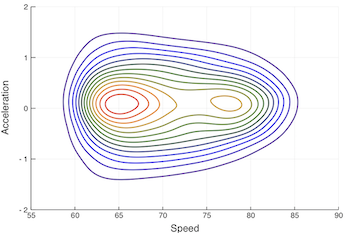
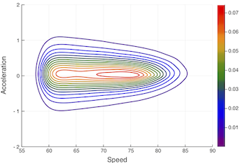
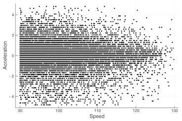
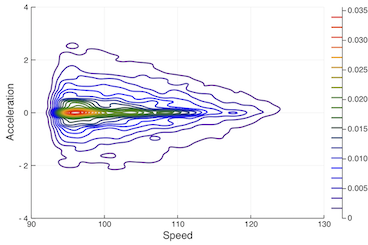

# TeleMap.jl

A package for the creation and analysis of telemetric heat maps.




## Kinematic Maps

Kinematic maps are probability heat maps of velocity and acceleration. These maps are estimated using
telemetry events via Bivariate Kernel Density Estimation. Each heat map contains a lower and upper bound for velocity(speed) and acceleration.





### Examples

```@example
# Kinematic Event Example

# defines a simple Kinematic Event
ke = KinematicEvent(2.0,0.0,DateTime(2019,2),MPH())
```

```@example
# Kinematic Events Example

# defines a collection of Kinematic Events

kes = KinematicEvents([2.0,3.0], [1.0,0.0], MPH(), repeat([DateTime(2019,2)],2))

```


```example
# Kinematic Map Example

# estimates a kinematic map and returns an object
kmap = KinematicMap(kes, [0.0,4.0],[-1.0,1.0])
```

### Examples of Plots
```julia
using TeleMap, Plots, Dates

# Define events
kes = KinematicEvents([2.0,3.0], [1.0,0.0], MPH(), repeat([DateTime(2019,2)],2))
#=
---------------------------
KinematicEvents object
---------------------------
No. Events: 2
SpeedType: MPH()
=#


# Define Map
kmap = KinematicMap(kes, [0.0,4.0],[-1.0,1.0])
#=
---------------------------
KinematicMap object
---------------------------
Velocity from 0.0 to 4.0
Acceleration from -1.0 to 1.0
No. Events: 1
SpeedType: MPH()
=#

# Plots heat map.
plot(kmap);

# Contour Style
x = range(kmap.vel_bounds[1], kmap.vel_bounds[2], length = 256);
y = range(kmap.aec_bounds[1], kmap.aec_bounds[2], length = 256);
z = kmap.kernel.density;
contour(x,y,z, color = :rainbow);

```


### Types
```@docs
KinematicEvent
```

```@docs
KinematicEvents
```

```@docs
KinematicMap
```

## Deviation Analysis
